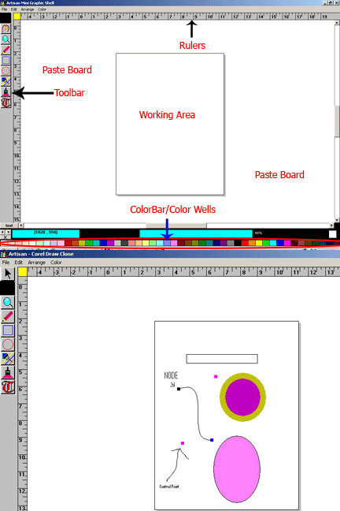



## CorelDraw Clone \- Vector Graphics Drawing Software

### Description

Corel DRAW like drawing software clone. Originally developed in VB3 and then later just converted to VB 6.

not completely implemented but whatever is Implemented is implemented using pure VB (with a few APIs) and nothing else, no third party libraries.

A must See for Graphic Fans.

I am releasing this as I do not have time to update the code. If there is really good amount of interest of users I will think of updating it with more features.

Currently What is implemented:

- Object Drawing

- Object Selection

- Object Resizing

- object Moving/Dragging (with mouse)

- Changing Object's Outline Width (thickness)

- Changing Object's Fill Color &amp; Outline Color

- Fly out menu like CorelDraw for Outline &amp; Fill

- Convert Line to Curve and Edit Node

What is not yet implemented

- Multiple Object Selection

- Object Grouping

- Object Rotation

- Adding unlimited New Nodes to a Curve

- Convert Rectangle/Ellipse/Text to Curve

- A full featured Outline Dialog similar to CorelDraw

- A full featured Fill Color Dialog similar to CorelDraw

- etc.

-etc.

There are many things to learn from this like How to maintain a list of objects, how to calculate the bounds of an Object, how to delete drawing when the user moves and object, etc. etc.
 
### More Info
 

             |
---                |---
**Submitted On**   |2003-09-19 16:09:42
**By**             |[Yogi Yang](https://github.com/Planet-Source-Code/PSCIndex/blob/master/ByAuthor/yogi-yang.md)
**Level**          |Advanced
**User Rating**    |5.0 (30 globes from 6 users)
**Compatibility**  |VB 3\.0, VB 6\.0
**Category**       |[Graphics](https://github.com/Planet-Source-Code/PSCIndex/blob/master/ByCategory/graphics__1-46.md)
**World**          |[Visual Basic](https://github.com/Planet-Source-Code/PSCIndex/blob/master/ByWorld/visual-basic.md)
**Archive File**   |[CorelDraw\_20947012222007\.zip](https://github.com/Planet-Source-Code/yogi-yang-coreldraw-clone-vector-graphics-drawing-software__1-69793/archive/master.zip)

